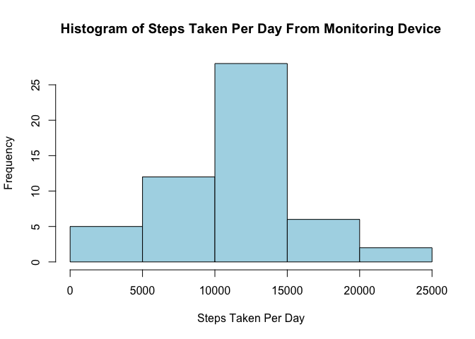
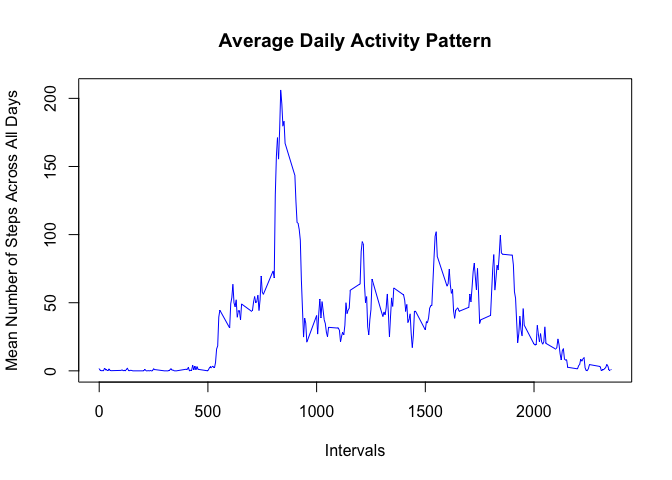
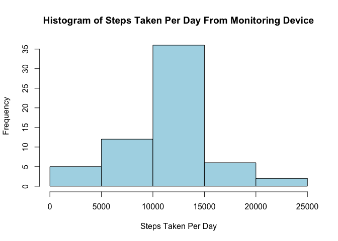
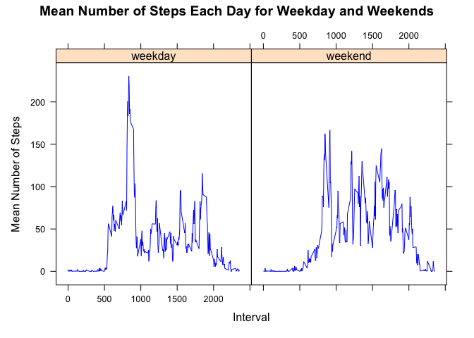

## Loading and preprocessing the data


```r
data <- read.csv("activity.csv")
data$date <- as.Date(data$date)
```

## 1.What is mean total number of steps taken per day? Also, answer the following prompts
a. Calculate the total number of steps taken per day

```r
complete_cases_df <- data[complete.cases(data$steps) == TRUE,]
steps_per_day <- aggregate(steps ~ date, complete_cases_df, sum)
```
b. Make a histogram of the total number of steps taken per day

```r
hist(steps_per_day$steps, xlab = "Steps Taken Per Day", ylab = "Frequency", col = "light blue", main = "Histogram of Steps Taken Per Day From Monitoring Device")
```

<!-- -->


c. Calculate and report the mean and median of the total number of steps per day

```r
mean(steps_per_day$steps)
```

```
## [1] 10766.19
```

```r
median(steps_per_day$steps)
```

```
## [1] 10765
```
Thus, to answer the main question, the mean total number of steps taken per day is 10766.19

## 2. What is the average daily activity pattern?
a. Make a time series plot (i.e. type = "l"\color{red}{\verb|type = "l"|}type = "l") of the 5-minute interval (x-axis) and the average number of steps taken, averaged across all days (y-axis)


```r
mean_interval <- aggregate(steps ~ interval, complete_cases_df, mean)
plot(x=mean_interval$interval, y = mean_interval$steps , type = 'l', xlab = "Intervals", ylab = "Mean Number of Steps Across All Days", main = "Average Daily Activity Pattern", col = "blue")
```

<!-- -->

b. Which 5-minute interval, on average across all the days in the dataset, contains the maximum number of steps?


```r
mean_interval[mean_interval$steps == max(mean_interval$steps), ]$interval
```

```
## [1] 835
```

## Imputing missing values
a. Calculate and report the total number of missing values in the dataset (i.e. the total number of rows with NAs)

```r
sum(!complete.cases(data))
```

```
## [1] 2304
```

b. Devise a strategy for filling in all of the missing values in teh dataset.
My strategy is for any row with an NA value in it, to just use the mean for that 5 minute interval

c. Create a new dataset that is equal to the original dataset but with the missing data filled in

```r
has_na <- data[!complete.cases(data), ]
new_values <- c()
for (x in 1:nrow(has_na)){
  interval <- has_na[x,3]
  mean <- mean_interval[mean_interval$interval == interval, 2]
  new_values <- append(new_values, mean)
}

has_na$steps <- new_values
new_df <- rbind(has_na, complete_cases_df)
```

d. Make a histogram of the total number of steps taken each day and calculate and report the mean and median total number of steps taken per day. Do these values differ from the estimates from the first part of the assignment? What is the impact of imputing missing data on the estimates of the total daily number of steps?


```r
total_steps <- aggregate(steps ~ date, new_df, sum)
hist(total_steps$steps, xlab = "Steps Taken Per Day",  main = "Histogram of Steps Taken Per Day From Monitoring Device", col = "light blue")
```

<!-- -->

```r
mean(total_steps$steps)
```

```
## [1] 10766.19
```

```r
median(total_steps$steps)
```

```
## [1] 10766.19
```
The mean is the same as the first part of the assignment but the median is different. Imputing missing data seems to make the median equal to the mean, which makes the distribution more accurate.

## Are there differences in activity patterns between weekdays and weekends?
a. Create a new factor variable in the dataset with two levels – “weekday” and “weekend” indicating whether a given date is a weekday or weekend day.


```r
new_df$date <- as.Date(new_df$date)
is_weekday <- weekdays(new_df$date)
is_weekend <- c()
for (x in 1:length(is_weekday)) 
{
  if (is_weekday[x] %in% c("Sunday", "Saturday")) {
    x <- "weekend"
   is_weekend <- append(is_weekend, x)

   
  }
  else {
     x<- "weekday"
     is_weekend <- append(is_weekend, x)
  }
}
dayOfWeekdf <- transform(new_df, dayOfWeek = is_weekend)
dayOfWeekdf$dayOfWeek <- factor(dayOfWeekdf$dayOfWeek)
```

b. Make a panel plot containing a time series plot of the 5-minute interval and the average number of steps taken, average across all weekday days or weekend days. 

```r
rm(mean)

meanDayOfWeek <- aggregate(steps ~ dayOfWeek + interval, dayOfWeekdf, mean)
library(lattice)
xyplot(steps ~ interval | dayOfWeek, meanDayOfWeek, type = "l", xlab='Interval', ylab = "Mean Number of Steps", main = "Mean Number of Steps Each Day for Weekday and Weekends", col = "blue")
```

<!-- -->
